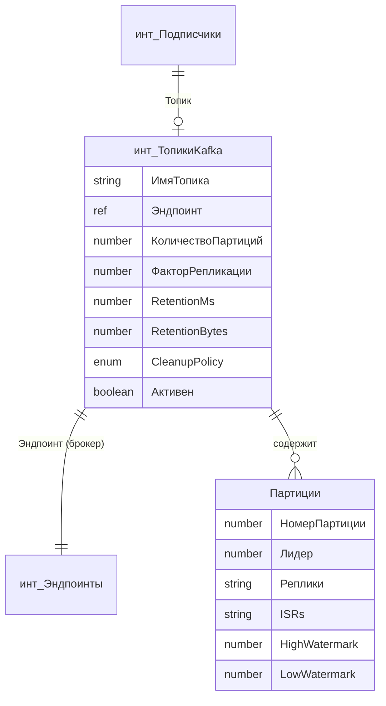

# Спецификация: Справочник Топики Kafka

## Обзор изменений

Преобразование строкового поля `ИмяТопика` в справочник `инт_ТопикиKafka` для полноценного управления топиками Kafka.

## 1. Новый справочник: инт_ТопикиKafka

### Основные свойства
- **Имя**: `инт_ТопикиKafka`
- **Синоним**: `(инт) Топики Kafka`
- **Длина кода**: 9 (строка)
- **Длина наименования**: 255

### Реквизиты

| Имя | Тип | Описание | Обязательное |
|-----|-----|----------|--------------|
| `ИмяТопика` | Строка(255) | Имя топика в Kafka | Да |
| `Эндпоинт` | СправочникСсылка.инт_Эндпоинты | Ссылка на брокер/кластер Kafka | Да |
| `КоличествоПартиций` | Число(3,0) | Количество партиций топика | - |
| `ФакторРепликации` | Число(2,0) | Фактор репликации | - |
| `RetentionMs` | Число(15,0) | Время хранения сообщений (мс) | - |
| `RetentionBytes` | Число(15,0) | Максимальный размер данных | - |
| `CleanupPolicy` | Перечисление.инт_КлассификацияОчисткиKafka | delete/compact | - |
| `Активен` | Булево | Флаг активности топика | - |
| `Комментарий` | Строка(0) | Описание назначения топика | - |

### Табличная часть: Партиции
Для отображения информации о партициях (только для чтения, заполняется из Kafka):

| Имя | Тип | Описание |
|-----|-----|----------|
| `НомерПартиции` | Число(5,0) | ID партиции |
| `Лидер` | Число(5,0) | ID брокера-лидера |
| `Реплики` | Строка(255) | JSON массив ID реплик |
| `ISRs` | Строка(255) | JSON массив синхронизированных реплик |
| `HighWatermark` | Число(15,0) | High watermark партиции |
| `LowWatermark` | Число(15,0) | Low watermark партиции |

### Формы
1. **ФормаЭлемента** - редактирование топика с возможностью:
   - Просмотр/редактирование основных свойств
   - Кнопка "Создать топик в Kafka" 
   - Кнопка "Удалить топик из Kafka"
   - Кнопка "Обновить информацию" (загрузка метаданных)
   - Отображение таблицы партиций с watermarks
   - Отображение списка consumer groups

2. **ФормаСписка** - список топиков с фильтрацией по эндпоинту

### Модуль менеджера

```bsl
#Область ПрограммныйИнтерфейс

// Создает топик в Kafka и сохраняет информацию в справочнике
//
// Параметры:
//  ИмяТопика - Строка - Имя создаваемого топика
//  Эндпоинт - СправочникСсылка.инт_Эндпоинты - Ссылка на эндпоинт брокера
//  КоличествоПартиций - Число - Количество партиций (по умолчанию 1)
//  ФакторРепликации - Число - Фактор репликации (по умолчанию 1)
//
// Возвращаемое значение:
//  СправочникСсылка.инт_ТопикиKafka - Ссылка на созданный элемент
//
Функция СоздатьТопик(ИмяТопика, Эндпоинт, КоличествоПартиций = 1, ФакторРепликации = 1) Экспорт
КонецФункции

// Удаляет топик из Kafka
//
// Параметры:
//  Топик - СправочникСсылка.инт_ТопикиKafka - Ссылка на топик
//  УдалятьИзСправочника - Булево - Удалять ли запись из справочника
//
Процедура УдалитьТопик(Топик, УдалятьИзСправочника = Ложь) Экспорт
КонецПроцедуры

// Получает актуальную информацию о топике из Kafka и обновляет справочник
//
// Параметры:
//  Топик - СправочникСсылка.инт_ТопикиKafka - Ссылка на топик
//
// Возвращаемое значение:
//  Структура - Информация о топике (партиции, watermarks, consumer groups)
//
Функция ОбновитьИнформациюОТопике(Топик) Экспорт
КонецФункции

// Получает настройки топика из Kafka
//
// Параметры:
//  Топик - СправочникСсылка.инт_ТопикиKafka - Ссылка на топик
//
// Возвращаемое значение:
//  Структура - Настройки топика (retention.ms, retention.bytes, cleanup.policy и т.д.)
//
Функция ПолучитьНастройкиТопика(Топик) Экспорт
КонецФункции

// Устанавливает настройки топика в Kafka
//
// Параметры:
//  Топик - СправочникСсылка.инт_ТопикиKafka - Ссылка на топик
//  Настройки - Структура - Структура настроек {retention.ms, retention.bytes, ...}
//
Процедура УстановитьНастройкиТопика(Топик, Настройки) Экспорт
КонецПроцедуры

// Проверяет существование топика в Kafka
//
// Параметры:
//  Топик - СправочникСсылка.инт_ТопикиKafka - Ссылка на топик
//
// Возвращаемое значение:
//  Булево - Истина, если топик существует в Kafka
//
Функция ТопикСуществует(Топик) Экспорт
КонецФункции

// Получает список consumer groups, подписанных на топик
//
// Параметры:
//  Топик - СправочникСсылка.инт_ТопикиKafka - Ссылка на топик
//
// Возвращаемое значение:
//  Массив - Массив структур с информацией о consumer groups
//
Функция ПолучитьКонсьюмеровТопика(Топик) Экспорт
КонецФункции

// Получает отставание (lag) consumer group по топику
//
// Параметры:
//  Топик - СправочникСсылка.инт_ТопикиKafka - Ссылка на топик
//  ИмяГруппы - Строка - Имя consumer group
//
// Возвращаемое значение:
//  Структура - Информация об отставании (total_lag, партиции с их lag)
//
Функция ПолучитьОтставаниеКонсьюмера(Топик, ИмяГруппы) Экспорт
КонецФункции

// Находит или создает элемент справочника по имени топика и эндпоинту
//
// Параметры:
//  ИмяТопика - Строка - Имя топика
//  Эндпоинт - СправочникСсылка.инт_Эндпоинты - Ссылка на эндпоинт
//  СоздаватьЕслиНеНайден - Булево - Создавать элемент если не найден
//
// Возвращаемое значение:
//  СправочникСсылка.инт_ТопикиKafka, Неопределено - Ссылка на найденный/созданный элемент
//
Функция НайтиТопикПоИмени(ИмяТопика, Эндпоинт, СоздаватьЕслиНеНайден = Ложь) Экспорт
КонецФункции

#КонецОбласти
```

---

## 2. Новое перечисление: инт_КлассификацияОчисткиKafka

| Значение | Синоним | Описание |
|----------|---------|----------|
| `Delete` | Delete | Удаление старых записей по времени/размеру |
| `Compact` | Compact | Компактификация - сохранение последнего значения для каждого ключа |
| `DeleteCompact` | Delete + Compact | Комбинированная политика |

---

## 3. Изменения в справочнике инт_Подписчики

### Изменяемые реквизиты

| Старый реквизит | Новый реквизит | Тип |
|-----------------|----------------|-----|
| `ИмяТопика` (Строка 255) | `Топик` | СправочникСсылка.инт_ТопикиKafka |

### Обновление формы ФормаЭлемента
- Заменить поле ввода строки `ИмяТопика` на поле выбора `Топик` типа справочник
- Добавить параметры связи выбора: фильтрация по эндпоинту (если эндпоинт заполнен)
- Сохранить кнопку "Создать топик" - теперь она создает элемент справочника и топик в Kafka
- Обновить логику проверки статуса топика - использовать методы справочника

---

## 4. Расширение модуля инт_РаботаСКафка

Добавить новые методы для работы с Admin API:

```bsl
// Создает топик в Kafka
Функция СоздатьТопик(Брокеры, ИмяТопика, КоличествоПартиций = 1, ФакторРепликации = 1) Экспорт

// Удаляет топик из Kafka  
Функция УдалитьТопик(Брокеры, ИмяТопика) Экспорт

// Получает настройки топика
Функция ПолучитьНастройкиТопика(Брокеры, ИмяТопика) Экспорт

// Устанавливает настройки топика
Функция УстановитьНастройкиТопика(Брокеры, ИмяТопика, НастройкиJSON) Экспорт

// Получает отставание консьюмера
Функция ПолучитьОтставаниеКонсьюмера(Брокеры, ИмяТопика, ИмяГруппыКонсьюмеров) Экспорт

// Получает список consumer groups топика
Функция ПолучитьКонсьюмеровТопика(Брокеры, ИмяТопика) Экспорт

// Получает границы партиции (watermarks)
Функция ПолучитьГраницыПартиции(Брокеры, ИмяТопика, НомерПартиции) Экспорт

// Получает количество сообщений в партиции
Функция ПолучитьКоличествоСообщенийВПартиции(Брокеры, ИмяТопика, НомерПартиции) Экспорт

// Получает информацию о кластере
Функция ПолучитьИнформациюОКластере(Брокеры) Экспорт

// Получает список всех топиков
Функция ПолучитьСписокТопиков(Брокеры) Экспорт
```

---

## 5. Обновление модуля инт_РаботаССообщениямиKafka

Изменить процедуру `ОтправитьСообщение` для работы со справочником топиков:

```bsl
// БЫЛО:
ИмяТопика = Подписчик.ИмяТопика;
Брокеры = Подписчик.СсылкаНаСервис.АдресРесурса;
инт_РаботаСКафка.ОтправитьСообщение(Сообщение.СформированноеСообщение, Брокеры, ИмяТопика);

// СТАЛО:
Топик = Подписчик.Топик;
ИмяТопика = Топик.ИмяТопика;
Брокеры = Топик.Эндпоинт.АдресРесурса;
инт_РаботаСКафка.ОтправитьСообщение(Сообщение.СформированноеСообщение, Брокеры, ИмяТопика);
```

---

## 6. Миграция данных

Скрипт для переноса существующих данных:

```bsl
Процедура МиграцияТопиковВСправочник() Экспорт
    // 1. Получить все подписчики типа Kafka
    Запрос = Новый Запрос;
    Запрос.Текст = "
    |ВЫБРАТЬ
    |   Подписчики.Ссылка КАК Подписчик,
    |   Подписчики.ИмяТопика КАК ИмяТопика,
    |   Подписчики.СсылкаНаСервис КАК Эндпоинт
    |ИЗ
    |   Справочник.инт_Подписчики КАК Подписчики
    |ГДЕ
    |   Подписчики.ТипПодписчика = &ТипKafka
    |   И Подписчики.ИмяТопика <> """"";
    Запрос.УстановитьПараметр("ТипKafka", Перечисления.инт_ТипыПодписчиков.Kafka);
    
    Выборка = Запрос.Выполнить().Выбрать();
    
    Пока Выборка.Следующий() Цикл
        // 2. Найти или создать элемент справочника топиков
        Топик = Справочники.инт_ТопикиKafka.НайтиТопикПоИмени(
            Выборка.ИмяТопика,
            Выборка.Эндпоинт,
            Истина // Создать если не найден
        );
        
        // 3. Обновить подписчика
        ПодписчикОбъект = Выборка.Подписчик.ПолучитьОбъект();
        ПодписчикОбъект.Топик = Топик;
        ПодписчикОбъект.Записать();
    КонецЦикла;
КонецПроцедуры
```

---

## Диаграмма связей



---

## Порядок внедрения

1. ✅ Создать перечисление `инт_КлассификацияОчисткиKafka`
2. ✅ Создать справочник `инт_ТопикиKafka` с реквизитами и табличной частью
3. ✅ Создать модуль менеджера справочника
4. ✅ Создать формы справочника
5. ✅ Расширить модуль `инт_РаботаСКафка` методами Admin API
6. ✅ Добавить реквизит `Топик` в справочник `инт_Подписчики`
7. ✅ Обновить форму `инт_Подписчики.ФормаЭлемента`
8. ✅ Обновить модуль `инт_РаботаССообщениямиKafka`
9. ✅ Запустить миграцию данных
10. ✅ Удалить старый реквизит `ИмяТопика` из `инт_Подписчики`
