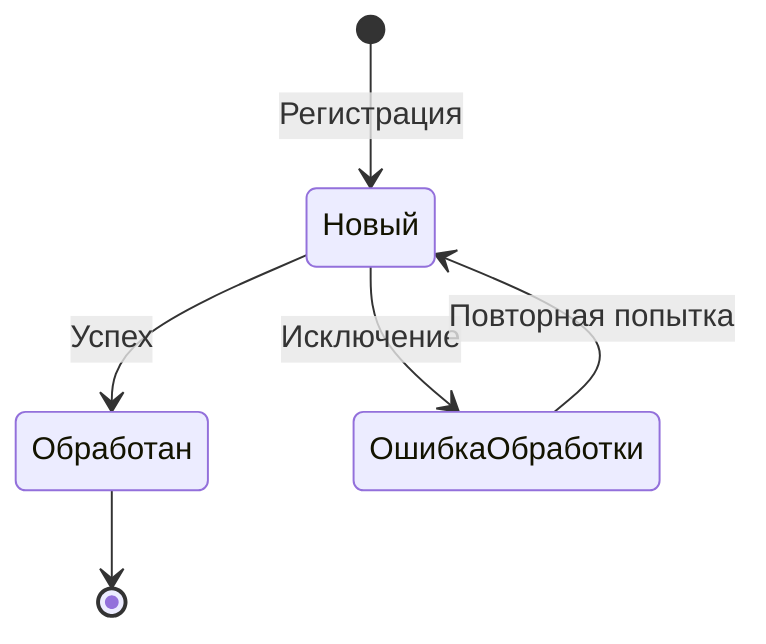

# Обработка входящих HTTP-запросов

Подсистема предоставляет HTTP-сервис для приёма входящих сообщений от внешних систем. Данное руководство описывает формат запросов, коды ответов и типичные сценарии ошибок.

## Архитектура обработки

```
┌─────────────────┐         ┌─────────────────┐         ┌─────────────────┐
│  Внешняя        │  POST   │  HTTP-сервис    │         │  Очередь или    │
│  система        │────────▶│  валидация      │────────▶│  синхронная     │
│                 │         │  маршрутизация  │         │  обработка      │
└─────────────────┘         └─────────────────┘         └─────────────────┘
```

### Этапы обработки

1. **Валидация параметров URL** — проверка `flow_id` и `message_id`
2. **Поиск потока** — поиск активного входящего потока по идентификатору
3. **Парсинг тела** — десериализация JSON
4. **Валидация схемы** — проверка по OpenAPI (если включена в потоке)
5. **Обработка** — асинхронная (через очередь) или синхронная

## Формат запроса

### Endpoint

```
POST /hs/integration/incoming/{flow_id}/{message_id}
```

| Параметр | Тип | Обязательный | Описание |
|----------|-----|--------------|----------|
| `flow_id` | Строка | Да | Код входящего потока (реквизит `ИдентификаторПотока` или `Код`) |
| `message_id` | UUID | Да | Уникальный идентификатор сообщения |

### Headers

| Header | Значение | Описание |
|--------|----------|----------|
| `Content-Type` | `application/json` | Тип содержимого |
| `Authorization` | Basic/Bearer | Авторизация (настраивается отдельно) |

### Body

JSON-объект, структура которого определяется схемой валидации потока.

## Коды ответов

### Успешная обработка (2xx)

| Код | Тело ответа | Описание |
|-----|-------------|----------|
| **200** | `SUCCESS` | Сообщение успешно обработано (синхронно) или поставлено в очередь (асинхронно) |

### Ошибки клиента (4xx)

Ошибки 4xx означают проблемы с запросом. Клиент должен исправить запрос перед повторной отправкой.

| Код | Сообщение | Причина | Решение |
|-----|-----------|---------|---------|
| **400** | `flow_id is missing` | Не указан идентификатор потока в URL | Добавьте `flow_id` в путь запроса |
| **400** | `message_id is missing` | Не указан идентификатор сообщения | Добавьте `message_id` (UUID) в путь запроса |
| **400** | `message_id must be uuid` | `message_id` не является валидным UUID | Используйте формат `xxxxxxxx-xxxx-xxxx-xxxx-xxxxxxxxxxxx` |
| **400** | `body is empty` | Тело запроса пустое | Отправьте JSON в теле запроса |
| **400** | `payload deserialization failed. Extended info: {details}` | Невалидный JSON в теле запроса | Проверьте синтаксис JSON |
| **400** | `body validation failed. Extended info: {details}` | Данные не соответствуют OpenAPI-схеме | Приведите данные в соответствие со схемой |
| **405** | `unknown flow_id` | Поток с указанным кодом не найден или не является входящим | Проверьте код потока и его направление |

### Ошибки сервера (5xx)

Ошибки 5xx означают проблемы на стороне сервера. Клиент может повторить запрос позже.

| Код | Сообщение | Причина | Действия |
|-----|-----------|---------|----------|
| **500** | `Unexpected server error. Extended info: {details}` | Ошибка при обработке сообщения или записи в очередь | Проанализировать журнал регистрации, исправить обработчик потока |

## Режимы обработки

### Асинхронная обработка (по умолчанию)

Если в потоке включён флаг `АсинхроннаяОбработка`:

1. Сообщение записывается в регистр `инт_ОчередьВходящихСообщений`
2. Устанавливается статус `Новый` в `инт_ТекущийСтатусВходящихСообщений`
3. HTTP-ответ **200** возвращается сразу
4. Фоновое задание `инт_ОбработкаВходящейОчереди` обрабатывает сообщение

```
┌─────────────┐     ┌─────────────┐     ┌─────────────┐     ┌─────────────┐
│   Запрос    │────▶│   Очередь   │────▶│  Фоновое    │────▶│  Обработчик │
│   HTTP      │     │   (регистр) │     │  задание    │     │  потока     │
└─────────────┘     └─────────────┘     └─────────────┘     └─────────────┘
        │                                                          │
        │◀─────────── 200 OK ───────────────────────────────────────
```

**Преимущества:**
- Быстрый ответ клиенту
- Отказоустойчивость при сбоях
- Повторная обработка при ошибках

### Синхронная обработка

Если `АсинхроннаяОбработка = Ложь`:

1. Обработчик потока выполняется сразу
2. При успехе — ответ **200**
3. При ошибке — ответ **500**

```
┌─────────────┐     ┌─────────────┐
│   Запрос    │────▶│  Обработчик │
│   HTTP      │     │  потока     │
└─────────────┘     └─────────────┘
        │                  │
        │◀──── 200/500 ────┘
```

**Когда использовать:**
- Критически важна немедленная обратная связь
- Внешняя система ждёт результата обработки
- Простые операции без риска таймаута

::: warning Таймауты
При синхронной обработке учитывайте таймауты HTTP-клиента. Долгие операции могут привести к разрыву соединения.
:::

## Жизненный цикл сообщения

### Статусы входящих сообщений

| Статус | Описание |
|--------|----------|
| `Новый` | Сообщение зарегистрировано в очереди |
| `Обработан` | Успешно обработано обработчиком потока |
| `ОшибкаОбработки` | Обработчик завершился с ошибкой |

### Диаграмма переходов



## Валидация входящих данных

Если в потоке включена валидация (`Валидация = Истина`):

1. Данные проверяются по схеме **до** записи в очередь
2. При несоответствии — ответ **400** с детальным описанием ошибки
3. Сообщение **не** попадает в очередь

### Структура ошибки валидации

```
body validation failed.

Extended info:{описание ошибки от валидатора}
```

Типичные ошибки валидации:
- Отсутствует обязательное поле (`required property missing`)
- Неверный тип данных (`expected string, got number`)
- Значение не соответствует формату (`does not match pattern`)
- Значение вне допустимого диапазона (`value out of range`)

## Примеры запросов

### Успешный запрос

```bash
curl -X POST \
  'https://server/hs/integration/incoming/ORDER_IMPORT/550e8400-e29b-41d4-a716-446655440000' \
  -H 'Content-Type: application/json' \
  -H 'Authorization: Basic dXNlcjpwYXNz' \
  -d '{
    "orderNumber": "ORD-001",
    "orderDate": "2025-01-28",
    "customer": {
      "inn": "1234567890",
      "name": "ООО Компания"
    },
    "items": [
      {"sku": "ART001", "quantity": 10}
    ]
  }'
```

Ответ:
```
HTTP/1.1 200 OK
Content-Type: text/plain

SUCCESS
```

### Ошибка: невалидный JSON

```bash
curl -X POST \
  'https://server/hs/integration/incoming/ORDER_IMPORT/550e8400-e29b-41d4-a716-446655440000' \
  -H 'Content-Type: application/json' \
  -d '{"orderNumber": "ORD-001", invalid}'
```

Ответ:
```
HTTP/1.1 400 Bad Request
Content-Type: text/plain

payload deserialization failed. Extended info: Ошибка при вызове метода контекста (ПрочитатьJSON)...
```

### Ошибка: неизвестный поток

```bash
curl -X POST \
  'https://server/hs/integration/incoming/UNKNOWN_FLOW/550e8400-e29b-41d4-a716-446655440000' \
  -H 'Content-Type: application/json' \
  -d '{}'
```

Ответ:
```
HTTP/1.1 405 Method Not Allowed
Content-Type: text/plain

unknown flow_id
```

### Ошибка: невалидный message_id

```bash
curl -X POST \
  'https://server/hs/integration/incoming/ORDER_IMPORT/not-a-uuid' \
  -H 'Content-Type: application/json' \
  -d '{}'
```

Ответ:
```
HTTP/1.1 400 Bad Request
Content-Type: text/plain

message_id must be uuid
```

## Обработка ошибок на стороне клиента

### Стратегия повторных попыток

| Код | Повторять? | Интервал | Комментарий |
|-----|------------|----------|-------------|
| 200 | — | — | Успех |
| 400 | Нет | — | Исправить запрос |
| 405 | Нет | — | Проверить конфигурацию |
| 500 | Да | Экспоненциальный | 1с → 2с → 4с → 8с... |
| Таймаут | Да | Линейный | С тем же message_id |

### Идемпотентность

::: tip message_id для идемпотентности
Используйте один и тот же `message_id` при повторных попытках. Это позволяет избежать дублирования на стороне 1С (если реализовано в обработчике).
:::

### Пример клиента с retry

```python
import requests
import time
from uuid import uuid4

def send_message(flow_id: str, payload: dict, max_retries: int = 3):
    message_id = str(uuid4())
    url = f"https://server/hs/integration/incoming/{flow_id}/{message_id}"
    
    for attempt in range(max_retries):
        try:
            response = requests.post(
                url,
                json=payload,
                auth=('user', 'password'),
                timeout=30
            )
            
            if response.status_code == 200:
                return {"success": True, "message_id": message_id}
            
            if response.status_code < 500:
                # Ошибка клиента — не повторяем
                return {
                    "success": False,
                    "error": response.text,
                    "retryable": False
                }
            
            # Ошибка сервера — повторяем
            time.sleep(2 ** attempt)
            
        except requests.Timeout:
            time.sleep(2 ** attempt)
    
    return {"success": False, "error": "Max retries exceeded", "retryable": True}
```

## Мониторинг и диагностика

### Журнал регистрации

Все ошибки записываются в журнал регистрации с событием:
- `ПодсистемаИнтеграции.ОбработкаВходящихСообщений`
- `ПодсистемаИнтеграции.ОчередьИсходящихСообщений`
- `ПодсистемаИнтеграции.МенеджерПотоковОбработкиВходящихСообщений`

### Prometheus-метрики

Подсистема экспортирует метрики для мониторинга:

| Метрика | Тип | Описание |
|---------|-----|----------|
| `pde_queue_length` | Gauge | Размер очередей по типам |
| `pde_error_count` | Gauge | Количество ошибок по типам и потокам |
| `pde_incoming_duration_seconds` | Gauge | Время обработки входящих (avg/max) |
| `pde_messages_per_minute` | Gauge | Пропускная способность |

::: tip Полная документация
Подробное описание всех метрик, настройки алертов и интеграции с Grafana см. в разделе [Мониторинг и метрики](/concepts/monitoring).
:::

## Безопасность

### Рекомендации

1. **Авторизация** — настройте Basic или Bearer авторизацию
2. **HTTPS** — используйте только защищённое соединение
3. **Rate limiting** — ограничьте количество запросов (на уровне веб-сервера)
4. **Валидация** — всегда включайте валидацию по схеме
5. **Логирование** — храните историю всех входящих запросов

## Связанные материалы

- [Потоки данных](/concepts/data-flows) — концепция потоков
- [Очереди сообщений](/concepts/message-queues) — работа с очередями
- [Валидация](/concepts/validation) — OpenAPI-схемы
- [Создание потока](/guide/create-flow) — пошаговое руководство
