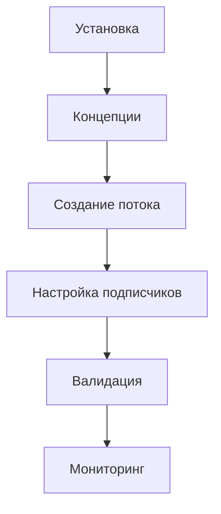

# Руководство пользователя

Добро пожаловать в руководство по подсистеме интеграции! Здесь вы найдёте пошаговые инструкции для типовых сценариев.

## Для кого это руководство

- **Разработчики 1С** — настройка интеграций из конфигуратора
- **Администраторы** — установка, мониторинг, обслуживание
- **Аналитики** — понимание возможностей подсистемы

## Быстрый старт

### 1. Создайте поток данных

Поток определяет, **какие данные** и **как** будут передаваться.

```bsl
// Создайте предопределённый элемент в Конфигураторе
// Справочник: инт_ПотокиДанных
// Код: ORDER_EXPORT
```

→ [Подробнее: Создание потока данных](/guide/create-flow)

### 2. Настройте подписчика

Подписчик определяет, **куда** отправлять данные.

→ [Подробнее: Настройка подписчиков](/guide/configure-subscribers)

### 3. Добавьте триггер

Зарегистрируйте сообщение при нужном событии:

```bsl
РегистрыСведений.инт_ОчередьИсходящихСообщений.ЗарегистрироватьСообщение(
    Ссылка,
    Справочники.инт_ПотокиДанных.ORDER_EXPORT
);
```

### 4. Готово!

Подсистема автоматически:
1. Сформирует сообщение (выполнит обработчик)
2. Провалидирует по схеме (если настроено)
3. Отправит всем подписчикам
4. Сохранит историю статусов

## Структура руководства

| Раздел | Описание |
|--------|----------|
| [Установка](/guide/installation) | Интеграция подсистемы в конфигурацию |
| [Создание потока](/guide/create-flow) | Пошаговое создание исходящего потока |
| [Настройка подписчиков](/guide/configure-subscribers) | HTTP, RabbitMQ, Kafka подписчики |
| [Обработка входящих HTTP](/guide/incoming-http-processing) | Приём данных, коды ответов, обработка ошибок |
| [Валидация](/guide/validation) | Настройка OpenAPI-схем |
| [Мониторинг](/guide/monitoring) | Prometheus и алерты |

## Типовые сценарии

### Отправка данных во внешнюю систему

```
Документ → Поток → HTTP-подписчик → REST API
```

1. Создать исходящий поток с обработчиком
2. Настроить HTTP-подписчика с endpoint
3. Добавить регистрацию сообщения при проведении

### Приём данных из внешней системы

```
REST API → HTTP-сервис → Входящий поток → Обработчик
```

1. Создать входящий поток с обработчиком
2. Настроить HTTP-сервис для приёма запросов
3. Обработчик создаёт/обновляет объекты в базе

### Обмен между базами 1С

```
База 1 (исходящий) ↔ База 2 (входящий)
```

1. Настроить подписчика типа "Подсистема интеграции"
2. Указать URL входящего HTTP-сервиса второй базы

## Рекомендуемый порядок изучения



## Поддержка

При возникновении вопросов:

1. Проверьте [FAQ](/guide/faq)
2. Изучите [Устранение неполадок](/guide/troubleshooting)
3. Создайте issue в [GitHub](https://github.com/your-org/integration_subsystem/issues)

## Следующий шаг

→ [Установка подсистемы](/guide/installation)
